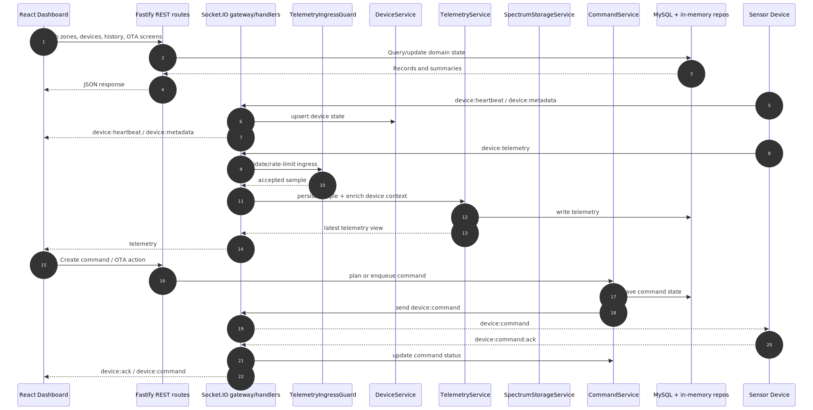
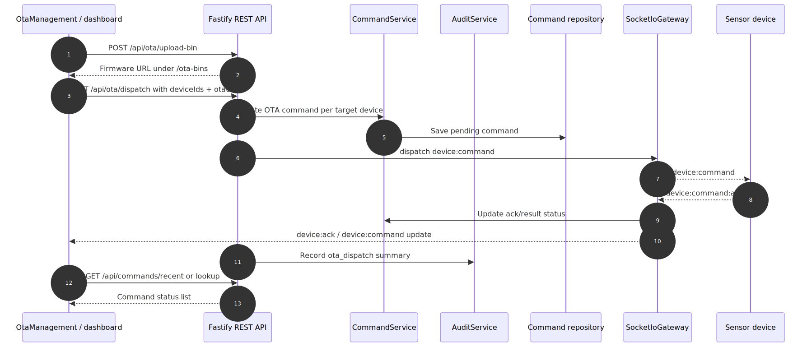

# Architecture diagrams

Bộ diagram này được tinh chỉnh từ dữ liệu generated trong `docs/architecture/generated` và Mermaid thô trong `docs/architecture/diagrams`. Mục tiêu là nhìn nhanh để hiểu hệ thống, nên một số module được gom nhóm thay vì vẽ mọi dependency chi tiết.

## Cách render lại

```bash
pnpm arch:all
```

Lệnh này chạy lại extract/generate architecture và render các Mermaid trong `docs/architecture/diagrams/refined` ra `docs/architecture/images` ở cả SVG và PNG.

## Diagrams

### 01. System context



- Mermaid: [`diagrams/refined/01-system-context.mmd`](./diagrams/refined/01-system-context.mmd)
- PNG: [`images/01-system-context.png`](./images/01-system-context.png)
- Cho thấy các actor/chạy chính: sensor devices, React dashboard, Fastify + Socket.IO backend, MySQL, in-memory stores và ops endpoints.

### 02. Runtime view



- Mermaid: [`diagrams/refined/02-runtime-view.mmd`](./diagrams/refined/02-runtime-view.mmd)
- PNG: [`images/02-runtime-view.png`](./images/02-runtime-view.png)
- Sequence tổng hợp cho ba luồng runtime quan trọng: REST fetch từ UI, telemetry realtime từ device và command/OTA từ dashboard xuống device.

### 03. Backend module map



- Mermaid: [`diagrams/refined/03-backend-module-map.mmd`](./diagrams/refined/03-backend-module-map.mmd)
- PNG: [`images/03-backend-module-map.png`](./images/03-backend-module-map.png)
- Map backend theo nhóm: edge adapters, device data path, operations domain, auth/audit và platform/persistence.

### 04. Telemetry flow



- Mermaid: [`diagrams/refined/04-telemetry-flow.mmd`](./diagrams/refined/04-telemetry-flow.mmd)
- PNG: [`images/04-telemetry-flow.png`](./images/04-telemetry-flow.png)
- Tập trung vào luồng `device:telemetry`: socket handler, ingress guard, device lookup, telemetry persistence, alert evaluation và broadcast realtime.

### 05. Spectrum flow



- Mermaid: [`diagrams/refined/05-spectrum-flow.mmd`](./diagrams/refined/05-spectrum-flow.mmd)
- PNG: [`images/05-spectrum-flow.png`](./images/05-spectrum-flow.png)
- Mô tả các event spectrum theo trục X/Y/Z, lưu bằng `SpectrumStorageService`, broadcast `telemetry:spectrum` và lookup lịch sử từ UI.

### 06. OTA command flow



- Mermaid: [`diagrams/refined/06-ota-command-flow.mmd`](./diagrams/refined/06-ota-command-flow.mmd)
- PNG: [`images/06-ota-command-flow.png`](./images/06-ota-command-flow.png)
- Sequence cho OTA/command: dashboard tạo action, command service lưu trạng thái, gateway gửi `device:command`, device ack và UI cập nhật trạng thái.

### 07. Cleanup candidates



- Mermaid: [`diagrams/refined/07-cleanup-candidates.mmd`](./diagrams/refined/07-cleanup-candidates.mmd)
- PNG: [`images/07-cleanup-candidates.png`](./images/07-cleanup-candidates.png)
- Tóm tắt tín hiệu từ `knip.txt`: các file/dependency/export/config hint chắc chắn đã được dọn; nếu có findings mới thì cần review thủ công trước khi xoá.

## Nguồn dữ liệu

- `docs/architecture/generated/summary.json`: số lượng file, module, routes, services, repositories và socket events.
- `docs/architecture/generated/modules.json`: module map và import giữa các nhóm.
- `docs/architecture/generated/routes.json`: REST route inventory.
- `docs/architecture/generated/socket-events.json`: Socket.IO inbound/outbound events.
- `docs/architecture/generated/services.json`: service classes.
- `docs/architecture/generated/repositories.json`: repository implementations.
- `docs/architecture/generated/frontend-api-calls.json`: frontend REST usage.
- `docs/architecture/generated/frontend-socket-calls.json`: frontend socket usage.
- `docs/architecture/generated/knip.txt`: cleanup candidates.
- `docs/architecture/generated/dependency-cruiser.json` và `docs/architecture/generated/madge.json`: dependency graph/cycle inputs.
